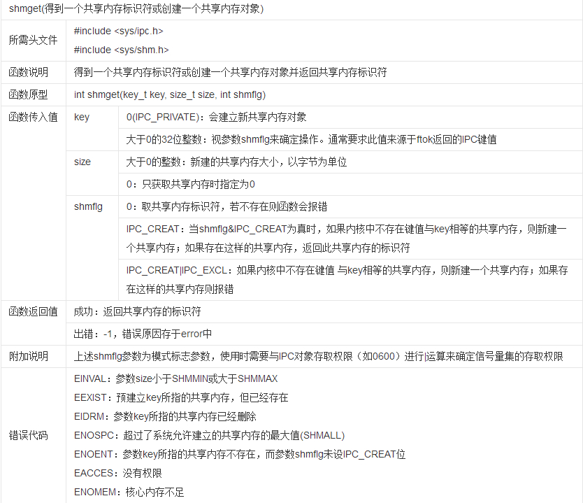
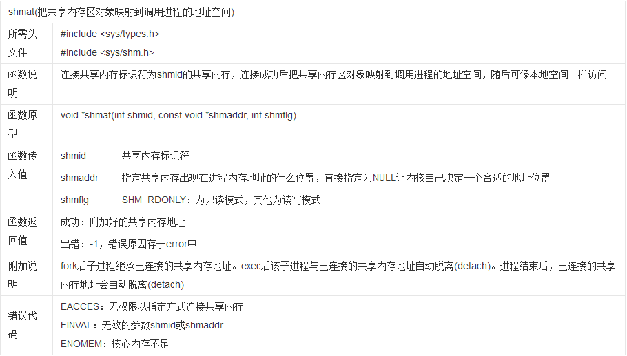
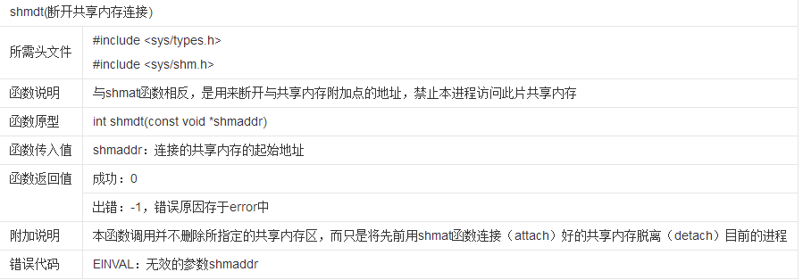
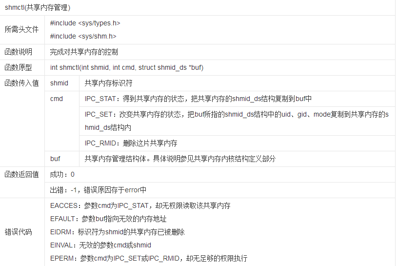

ICP - Share Memory
========
进程通信（IPC,Inter-Porcess Communcation）的方式比较多，目前比较常用的有管道（Pipe）、消息队列（Message Queue）、共享内存（Share Memory）、套接字（Socket）、信号量（Semaphore）、信号（Signal）等，本篇主要关于共享内存进行了一些简要的记录。

## 一、 windows 进程程通信共享内存

### 1.同一个可执行文件或DLL使用进程共享“数据段”进行数据共享

+ 描述
  - 限制：
    需要同一个执行文件或DLL的多个实例间才会共享。

  - 方法：
    创建自定义的共享“数据段”，如用一下的方式先定义自定义段的数据，并将自定义段属性设置为共享：

```c++
#pragma data_seg("MySectionName")
int g_instance_count = 0;
#pragma data_seg()
#pragma comment(linker, "/SECTION:MySectionName,RWS")
``` 

  注意“数据段”的属性有以下几种，类似Linux下文件的属性

    属性 | 意义
    ---- | ----
    READ | 可以从该段读取数据
    WRITE | 可以向该段写入数据
    EXECUTE | 可以执行该段的内容
    SHARED | 该段的内容为多个实例所共享（本质上是关闭了写时复制机制）

  在进行“数据段”属性设置时`#pragma comment(linker, "/SECTION:MySectionName,RWS")`只需要标明大写首字母即可，如`RWS`表示`READ|WRITE\|SHARED`。如上面共享数据段内的属性`g_instance_count`就会在定义了这一数据段的同一个执行文件或DLL多份实例间共享数据。虽然可以很容易的进行简单的数据共享，但是限制较多，可能某些情况下能用的着吧？ :joy: 

然后你就可以用这个属性干点事情比如，在每个进程开启的时候递增1，在进程退出的时候减少1，用于统计当前开启了多少个同类进程 -.-，这只是一个简单实例，demo就在下面。

* 这个东西在linux下试验了并没有生效-.- 所以列在了windows段下。

+ **demo**

    [传送门 点击直达 share_data](jqhgit.github.io/demo/tec/icpshm);
    windows下随便创建个控制台程序编译share_data.cpp内的程序，然后运行多个程序就行了，或者直接使用share_data.exe运行（能够正常运行话 -。-）。

+ **相关资料**

    [内存映射文件](https://www.cnblogs.com/5iedu/p/4926309.html)

### 2.内存映射(Memory Mapping)

待续...

## 二、 Linux 进程通信共享内存

### 利用共享内存函数进行进程间数据共享

+ **描述**
  - 限制：
    windows下无法使用，但可以实现无情缘关系进程通信。
  - 方法：
    使用shmget、shmat、shmdt、shmctl共享内存函数进行数据共享。

    至于函数原型就借用在百科上扣的图了 -.-，如下：

  > 

    在需要共享数据时，可以首先使用`shmget`来创建或者查找已经存在的共享内存。其中`key`参数理解为为内核中共享内存的编号，也就是一把访问共享内存的钥匙了；`size`则是创建的共享内存的大小；`shmflg` 参数在输入`0`的时候可以用来检测共享内存是否已经创建，正常创建时可以指定IPC_CREAT（没有回自动创建）。


  > 

    shmat则是获取共享内存的地址，通常返回一个`void *`的首地址指针。获取之后就能够对共享内存块进行读写操作了。


  > 

  > 

  具体的使用如果有兴趣可以在demo里面瞅瞅，虽然很low，但是意思还是有的... :joy: 

+ **demo**

    这个demo和共享数据段类似，就只是共享了一个int数值，用于统计开启了多少个进程，这个数值会在进程开启的时候+1，在进程退出时-1。
    
    再放一次传送门...:

    [传送门 点击直达 share_data](jqhgit.github.io/demo/tec/icpshm)

    你需要在linux下编译一下share_data.cpp，注意执行`dos2unix`进行格式转换，不然你会看到n多错误。然后运行多个程序就能看到效果了（CentOS/RedHat 最好是用多个终端同时运行，不然一个终端后台进程同时输出日志的话比较难受，如果是ubantu...应该没问题），或者直接使用share_data运行。


   <div id="gitmentContainer"></div>
   <link rel="stylesheet" href="https://billts.site/extra_css/gitment.css">
   <script src="https://billts.site/js/gitment.js"></script>
   <script src="../../gitment.js"></script>
