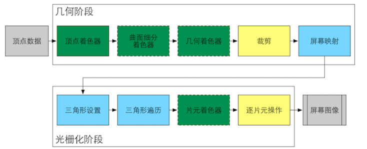

Shader 基础
===

Rendering 流程
---

渲染流程通常可以分为三个阶段：

**应用阶段（Application Stage）**、**几何阶段（Geometry Stage）** 和 **光栅化阶段（Rasterizer Stage）**。

+ 应用阶段（Application Stage）
  
    应用程序主导的阶段，由Cpu处理。这个阶段的主要任务是：
    1. 准备场景相关的数据，包括模型、光源、纹理、相机等；
    2. 场景物体粗剔除，剔除不可见的物体等，提高渲染性能；
    3. 设置渲染状态，使用材质、纹理、shader等。

    本阶段将输出 **渲染图元（Rendering primitives）**（点、线、三角面等）给几何阶段。

+ 几何阶段（Geometry Stage）

    几何阶段需要处理所有和待绘制的几何信息相关的事情，通常在GPU上进行。这个阶段主要任务有：
    1. 顶点空间变换、着色；
    2. 细分图元；
    3. 图元着色；
    4. 图元按可视区域裁剪；
    5. 图元坐标转换至屏幕坐标系等。

    本阶段输出的屏幕空间的二维顶点坐标，每个定点带有深度值、着色等相相关信息。

+ 光栅化阶段（Rasterizer Stage）

    光栅化阶段，接受来自几何阶段的屏幕像素信息，进行渲染输出图像。本阶段主要任务是对每个片元进行：
    1. 生成 **片元（Fragment）**；
    2. 修改颜色；
    2. 深度缓冲；
    3. 颜色混合等。

    光栅化阶段完成就形成了我们实际看到的渲染画面。

Draw Call
---
    
    Draw Call是一个由CPU发起的调用GPU进行图元渲染的命令。

    在Cpu在指定渲染相关的纹理、材质、着色器等渲染状态，以及需要渲染的图元列表后，会发起Draw Call命令，告诉GPU开始开始渲染。这个命令指向**一个**需要被渲染的**图元列表**,GPU接收到Draw Call调用时，会根据渲染状态和输入的顶点数据进行计算，并最终输出屏幕显示像素。

GPU 渲染流水线
---

    几何阶段、光栅化阶段正是借助GPU渲染流水线实现。GPU渲染的过程，虽然开发者无法拥有完整的控制权，但是GPU在渲染阶段，开放了部分阶段控制权，允许开发者配置或者编程。其中几何阶段、光栅化阶段在GPU的实现可以分为多个小的步骤，如下图（借用unity shader入门精要图）：
    > 
    *GPU渲染流水线实现。绿色--完全可编程 黄色--可配置不可编程 蓝色--GPU固定实现 虚线框--Shader可选*

+ 几何阶段

  - 1.顶点着色器（Vertex Shader） **[完全可编程]**

    渲染流水线的第一个阶段，输入来自CPU。顶点着色器不关心顶点间的关系，仅对输入的每个网格顶点进行坐标变换和颜色计算。由于不关心顶点间的关系，GPU可以利用本身的特性处理每个顶点，速度非常快。

    - 坐标变换

        着色器对每个输入的网格顶点从模型空间转换到齐次裁剪空间，通常再由硬件做透视除法，归一化到设备坐标（Normalized Device Coordinates, NDC）。
        需要注意NDC中坐标的 z 分量范围，OpenGL中 z 分量为[-1,1]，而DirectX的z分量为[0,1]。

    - 颜色计算

        确定顶点的颜色，如考虑顶点光照等。

  - 2.曲面细分着色器（Tessellation Shader） **[可选，可编程]**

    一个可选的着色器，用于细分图元。

  - 3.几何着色器（Geometry Shader） **[可选,可编程]**

    同样是一个可选的着色器，执行主图远的着色操作。

  - 4.裁剪（Clipping） **[可配置]**

    这个阶段，负责将图元按照可视区域裁剪，留下在可视区域内的图元部分。GPU硬件固定操作，丹裁剪操作支持配置。

  - 5.屏幕映射（Screen Mapping） **[无控制权]**

    经过裁剪阶段，顶点的坐标仍然是三维坐标系下的坐标。而屏幕映射则是把每个图元的x、y坐标转换到**屏幕坐标系（Screen Coordinates）**。屏幕映射不会对z坐标进行处理，而**屏幕坐标系**和**z**坐标一起构成了**窗口坐标系（Windows Coordiantes）**

+ 光栅化阶段

    光栅化阶段的两个重要目标：
        a. 计算每个图元覆盖了哪些像素；
        b. 计算被图元覆盖的像素颜色。

  - 1.三角形设置（Triangle Setup） **[无控制权]**
    
    为了能够计算出几何阶段处理后图元的三角网格所覆盖的像素，需要提前准备三角形边界的表示方式，而计算三角网格**表示数据**的过程就是三角形设置。本阶段的输出是为三角形遍历做准备的。

  - 2.三角形遍历（Triangle Traversal） 或 扫描变换（Scan Conversion） **[无控制权]**

    逐三角网格计算其覆盖的像素，被三角网格覆盖的所有像素以及对应的状态的集合被称之为**片元（Fragment）**。三角形遍历会根据上一阶段的计算结果判断三角网格覆盖了哪些像素，并对这些像素进行状态插值计算，像素状态包括但不限于屏幕坐标、深度、法线、纹理坐标等。

  - 3.片元着色器（Fragment Shader） 或 像素着色器（Pixel Shader） **[可选，可编程]**

    偏远着色器根据上一步输入的片元数据，计算像素的颜色值（一个或多个）。这个阶段可以完成很多重要的渲染技术，如纹理采样等。这个阶段的效果局限于单个片元。

  - 4.逐片元操作（Per-Fragment Operations） 或 输出合并阶段（Output-Merger）
  
    本阶段，将对片元进行合并。这个阶段主要的目标：
        a. **决定片元的可见性：逐个片元进行测试，通过测试的片元将被合并到颜色缓冲区，未通过测试的片元将被抛弃**，包括模板测试、深度测试等。
        b. **合并到颜色缓冲区**：与已存在颜色缓冲区中的颜色进行混合。

推荐书籍
---

+ 《Unity Shder 入门精要》

   

   <link rel="stylesheet" href="https://billts.site/extra_css/gitment.css">
   
   
